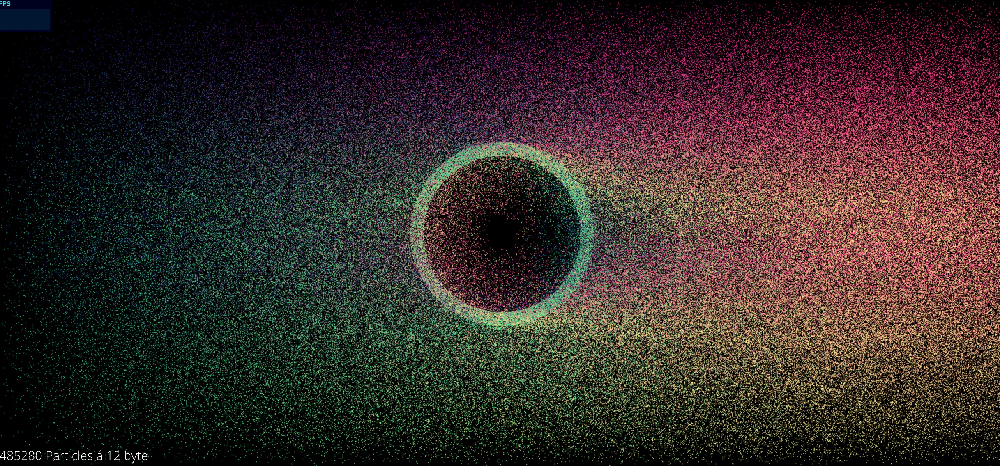

# wasm-particles

Forked from here:

* [Demo](https://maierfelix.github.io/wasm-particles/static)
* [src](https://github.com/maierfelix/wasm-particles)

This is a visual benchmark, each particle is updated from WebAssembly and then drawn to the screen with WebGL. Normally you would outsource everything to the GPU, but to showcase WASM's speed each particle is updated within the WASM module (and so updated on the CPU).

There is also some basic glue code to work with point based textures. You can tell the wasm module to allocate some space for a RGB texture and then have access from JS to manipulate it etc. Since there is no garbage collection for WebAssembly yet, you have to free the texture manually. The three example methods to work with textures: ``allocateTexture``, ``freeTexture`` and ``drawTexture`` which fills the texture's pixels into the relative particles.

# Screenshot



# Run
```
npm install
npm run build
npm start
```
then open your browser to http://localhost:8000

